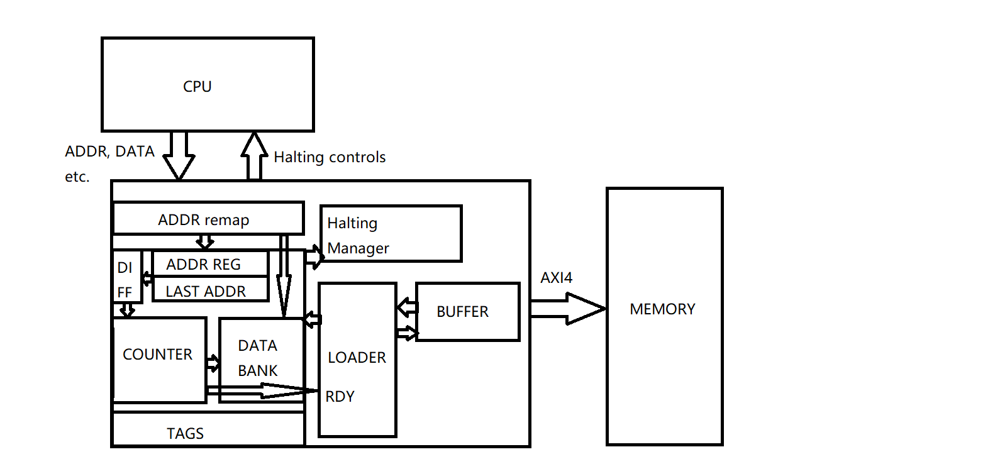
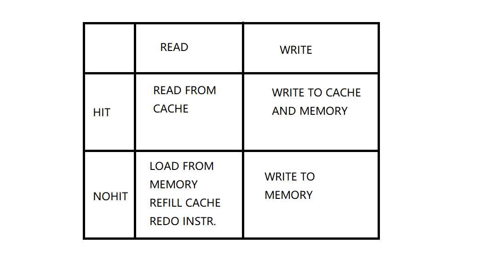

# Vexriscv Fork with a Cache Based on a Latency Accurate RTM model

This VexRiscv fork contains a data cache based on a latency accurate RTM model (racetrack memory model).

## How to Use This

Change into repo root dir  
`cd [repo_root]`  
Boot sbt  
`sbt`  
Compile verilog with config [GenMiscvAxi](./src/main/scala/vexriscv/demo/GenMiscvAxi.scala)  
`runMain vexriscv.demo.GenMiscvAxi`  
You can find the compiled verilog file in repo root dir.

A few things to keep in mind:

- Cached dbus plugins only work with mmus or pmps, if mmu is instantiated, a single D$ way cannt exceed 4KB.
- DBus and IBUS are instantiated to have a AXI port
- AMOs, LRSCs, invalidates and exclusives are not supported in the [cache configs](https://github.com/dockside-code/VexRiscv_simple/blob/91e35f77d78431eb9063205d9a198c83738d79ad/src/main/scala/vexriscv/ip/DataCache.scala#L27)

## The RTM Cache

In a racetrack memory, since the data are stored on the tracks in a linear fashion, the track has to be shifted during a read/write access for the read/write head to access the corresponding data location. This would produce a variable latency during each read and write access. The main advantage of RTMs, is its smaller cell size, so that when fitted to a cache, it'd have more storage capacity in comparison to a standard SRAM - based cache, producing less cache misses during runtime to compensate for the larger access latency. Furthermore, the RTM is a NVRAM (non-volatile RAM), meaning that even when powered - off, the data would still be retained on the RTM tracks.

In this implementation, the latency was modelled to be porpotionate to the relative difference between current access address and last access address. This implementation is used to determine the latency introduced by the RTMs in comparison to the normal SRAM based caches, intended to be a test and evaluation platform for testing out software - based optimization strategies targetting RTM based systems. Other types of memory models could also be easily fitted into the current system, providing that it follows certain behaviors listed below.

This document will focus on the data cache of the vexriscv core. If you are targetting other parts of the riscv system, refer to the original repo [here](https://github.com/SpinalHDL/VexRiscv).

The structure of our implemented cache:

The Data Cache is a bridging component between the rest of the processor and the data memory. The CPU, during a memory access, first reaches into the cache for the purpose of reducing access time (DRAMs take 10-20 cycles to complete a operation, whilst  SRAMs take 1-3, depending on the technology). During the access, the data cache of the vexriscv core observes the following policies:

The behavior of the cache: during read process, if hit, after examining the tags (SRAM based), read directly from the cache. If there's no hit, the cache load an entire line of data (regulated by a single burst from the AXI protocol based memory) from the main memory and write into the data bank. The cache issues a redo current command and the data is re - read from the cache.

During write process, if there's a hit, write both into cache and the main memory. Otherwise write ONLY to the main memory.

Due to the main memory being faster(!) in this case, a buffer was introduced between the memory and the cache. (See [here](<https://github.com/dockside-code/VexRiscv_simple/blob/91e35f77d78431eb9063205d9a198c83738d79ad/src/main/scala/vexriscv/ip/DataCache.scala#L955>)) This is only intended for the refill line operation, during which a burst is read into the cache. When the data bank is ready to take in more values, it informs the loader(See [here](<https://github.com/dockside-code/VexRiscv_simple/blob/91e35f77d78431eb9063205d9a198c83738d79ad/src/main/scala/vexriscv/ip/DataCache.scala#L1414>)), which in turn informs the buffer to give out the next value. The loader calculates the next cache address and writes into the cache. After the data bank is ready again, the loader and the buffer increments again.

The RTM model was implemented with a state machine. It enters counter incrementation mode upon read/write enable signals and exits upon the counter reaching the address difference between this access address and the last, (See [here](https://github.com/dockside-code/VexRiscv_simple/blob/91e35f77d78431eb9063205d9a198c83738d79ad/src/main/scala/vexriscv/ip/DataCache.scala#L714))during this it will emit a ready signal, informing others that it's ready to take in more values.

The track length, among other parameters for instantiation is customizable, [here](https://github.com/dockside-code/VexRiscv_simple/blob/91e35f77d78431eb9063205d9a198c83738d79ad/src/main/scala/vexriscv/ip/DataCache.scala#L119) as well as the cache line configs. 

The cache is programmed to halt the rest of the pipeline (execution and writeback) when:  
[See here](https://github.com/dockside-code/VexRiscv_simple/blob/91e35f77d78431eb9063205d9a198c83738d79ad/src/main/scala/vexriscv/ip/DataCache.scala#L1467)

- There's a refill process
- There's a W/R access to the cache and the databanks are not yet ready

## Supporting Other Memory Models

Other memories could easily be modelled with existing infrastructure [here](https://github.com/dockside-code/VexRiscv_simple/blob/91e35f77d78431eb9063205d9a198c83738d79ad/src/main/scala/vexriscv/ip/DataCache.scala#L679), as long as they follows:

- Able to do read/write operations continously. Meaning that the memory model should be able to accept a series of accesses during read/write (latency is a non - issue here, the RE/WE enable signals will be high for the entirety of the serial access).
- Emits a ready signal when read/write is complete (valid_dout).
- Accepts address (access_addr) for reading/writing, accepts data (din) for writing and gives out (dout) when read is complete.

This Repo also has a simple STT-RAM model integrated based on the numbers published [here](https://ieeexplore.ieee.org/stamp/stamp.jsp?tp=&arnumber=7851483), "Multi retention level STT-RAM cache designs with a dynamic refresh scheme, Z. Sun et al.". 

## Changelog

- Correct DataBank/Main Memory Access Timing:  
  
  1. Hit, Read: Read from Cache (takes n cycles) (Basically done).
  
  2. Hit, Write: Write to memory and cache (takes n cycles) (Basically done).
  
  3. No Hit, Write: Write Through (1 cycle due to write to BRAM) (done).
  
  4. No Hit, Read: Read entire line from BRAM to refill cache line. Write to cache and redo current instruction  
    (takes n by burstsize plus n cycles) (Basically done).  

- Correct Pipeline Timing:

  1. Halt execution phase during cache read/write, and treat it like a memory access. (Kind of sorted out.)
  
  2. Make sure such pipeline stalls does not affect operations. (Now haltsthe pipeline when there's an individual w/r request)

- Model a Latency - Accurate RTM model
  
  1. In progress (Basically done. Latency porpotionate to relative distance between addresses for access).

- Construct a more conprehensive and illustraing test program  (Done)

  1. Problem was probably casued by vivado simulation errors.

- Created a unified generator for memory models
  
  1. Integrated a SRAM model with parameterized access latencies.

  2. Integrated a RTM model with parameterized generation parameters, ringtrack, number of access ports, etc.
   
  3. Integrated a STT-RAM model with parameterized reading and writing latencies.

## Literature

- RTM Related

  1. "R. Bläsing et al., "Magnetic Racetrack Memory: From Physics to the Cusp of Applications Within a Decade," in Proceedings of the IEEE, vol. 108, no. 8, pp. 1303-1321, Aug. 2020, doi: 10.1109/JPROC.2020.2975719." [link](https://ieeexplore.ieee.org/stamp/stamp.jsp?tp=&arnumber=9045991&tag=1)
  
  2. "Guangyu Sun, Jishen Zhao, Matt Poremba, Cong Xu, Yuan Xie, Memory that never forgets: emerging nonvolatile memory and the implication for architecture design, National Science Review, Volume 5, Issue 4, July 2018, Pages 577–592." [link](https://doi.org/10.1093/nsr/nwx082)
  
  3. "F. Hameed and J. Castrillon, "BlendCache: An Energy and Area Efficient Racetrack Last-Level-Cache Architecture," in IEEE Transactions on Computer-Aided Design of Integrated Circuits and Systems, doi: 10.1109/TCAD.2022.3161198." [link](https://ieeexplore.ieee.org/stamp/stamp.jsp?tp=&arnumber=9739802)
  
  4. "Hugo Tárrega, Alejandro Valero, Vicente Lorente, Salvador Petit, and Julio Sahuquillo. 2022. Fast-track cache: a huge racetrack memory L1 data cache. In Proceedings of the 36th ACM International Conference on Supercomputing (ICS '22). Association for Computing Machinery, New York, NY, USA, Article 23, 1–12." [link](https://doi.org/10.1145/3524059.3532383)
  
  5. "G. Wang et al., "Ultra-Dense Ring-Shaped Racetrack Memory Cache Design," in IEEE Transactions on Circuits and Systems I: Regular Papers, vol. 66, no. 1, pp. 215-225, Jan. 2019, doi: 10.1109/TCSI.2018.2866932." [link](https://ieeexplore.ieee.org/stamp/stamp.jsp?tp=&arnumber=8458153)

- STT-RAM Related
  
  1. "F. Sampaio, M. Shafique, B. Zatt, S. Bampi and J. Henkel, "Approximation-aware Multi-Level Cells STT-RAM cache architecture," 2015 International Conference on Compilers, Architecture and Synthesis for Embedded Systems (CASES), 2015, pp. 79-88, doi: 10.1109/CASES.2015.7324548." [link](https://ieeexplore.ieee.org/stamp/stamp.jsp?tp=&arnumber=7324548)
  
  2. "Z. Sun et al., "Multi retention level STT-RAM cache designs with a dynamic refresh scheme," 2011 44th Annual IEEE/ACM International Symposium on Microarchitecture (MICRO), 2011, pp. 329-338." [link](https://ieeexplore.ieee.org/stamp/stamp.jsp?tp=&arnumber=7851483)

- Other Memory Technologies (not implemented)

  - PCMs
  
  1. "Gallo, Manuel & Sebastian, Abu. (2020). An overview of phase-change memory device physics. Journal of Physics D: Applied Physics. 53. 10.1088/1361-6463/ab7794." [link](https://iopscience.iop.org/article/10.1088/1361-6463/ab7794)
  
  2. "P. J. Nair, C. Chou, B. Rajendran and M. K. Qureshi, "Reducing read latency of phase change memory via early read and Turbo Read," 2015 IEEE 21st International Symposium on High Performance Computer Architecture (HPCA), 2015, pp. 309-319, doi: 10.1109/HPCA.2015.7056042." [link](https://ieeexplore.ieee.org/stamp/stamp.jsp?tp=&arnumber=7056042)
  
  3. "Shihao Song, Anup Das, Onur Mutlu, and Nagarajan Kandasamy. 2020. Improving phase change memory performance with data content aware access. In Proceedings of the 2020 ACM SIGPLAN International Symposium on Memory Management (ISMM 2020). Association for Computing Machinery, New York, NY, USA, 30–47." [link]( https://doi.org/10.1145/3381898.3397210)
  
  - ReRAMs
  
  1. "J. B. Kotra, M. Arjomand, D. Guttman, M. T. Kandemir and C. R. Das, "Re-NUCA: A Practical NUCA Architecture for ReRAM Based Last-Level Caches," 2016 IEEE International Parallel and Distributed Processing Symposium (IPDPS), 2016, pp. 576-585, doi: 10.1109/IPDPS.2016.79." [link](https://ieeexplore.ieee.org/stamp/stamp.jsp?tp=&arnumber=7516054)
  
  2. "W. Cadence et al., "Monolithically Integrated SRAM-ReRAM Cache-Main Memory System", Electrical & Computer Engineering Theses and Dissertations, UMD Theses and Dissertations." [link](http://hdl.handle.net/1903/27949)